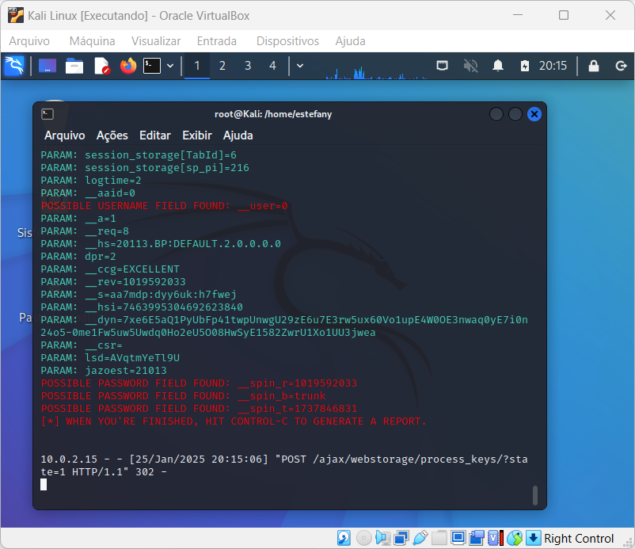

# Phishing - Captura de Credenciais


 


Esta é a minha resposta ao primeiro desafio de código oferecido pelo Bootcamp de Cibersegurança - Santander.

## Objetivo

Crie um Phishing que recrie a página de login do Facebook e capture as credenciais de acesso do usuário.

### Configurando o Phishing no Kali Linux

- Acesso root: ``` sudo su ```
- Iniciando o setoolkit: ``` setoolkit ```
- Tipo de ataque: ``` Social-Engineering Attacks ```
- Vetor de ataque: ``` Web Site Attack Vectors ```
- Método de ataque: ```Credential Harvester Attack Method ```
- Método de ataque: ``` Site Cloner ```
- Obtendo o endereço da máquina: ``` ifconfig ```
- URL para clone: http://www.facebook.com

### Resultados


